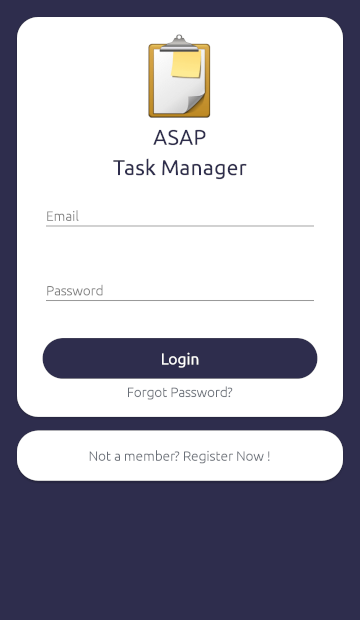

# ASAP-Tasks

 - [Overview](#overview)
     - [Description](#description)
	 - [About Asap Tasks](#about-asap-tasks)
 - [Screenshots](#screenshots)
 - [Contributions](#contributions)

-----

## Overview

### Description

Asap Tasks is an Xamarin Forms app that works with Microsoft Azure to provide developers a means to manage tasks and issues for their project. The app also generates insights to help developers keep track of their project progress.

*Note: The app requires an internet connection at all times.*

### About Asap Tasks

**Built With:**

* [Xamarin Forms (NetStandard 2.0.3)](https://docs.microsoft.com/en-us/xamarin/xamarin-forms/)
* [Microsoft Azure](https://azure.microsoft.com/en-us/)
* [Sendgrid](https://sendgrid.com/)
* [Microcharts](https://github.com/aloisdeniel/Microcharts)
* [Settings Plugin](https://github.com/jamesmontemagno/SettingsPlugin)
* [Xfx.Controls](https://github.com/XamFormsExtended/Xfx.Controls/blob/master/readme.md#ios)
* [Xamarin Forms Labs](https://github.com/XLabs/Xamarin-Forms-Labs)

## Screenshots
Login Page:

## Contributions

* [ShyamPanchal](https://github.com/ShyamPanchal)
